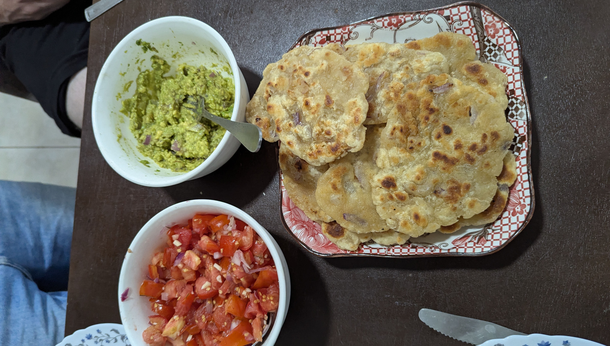
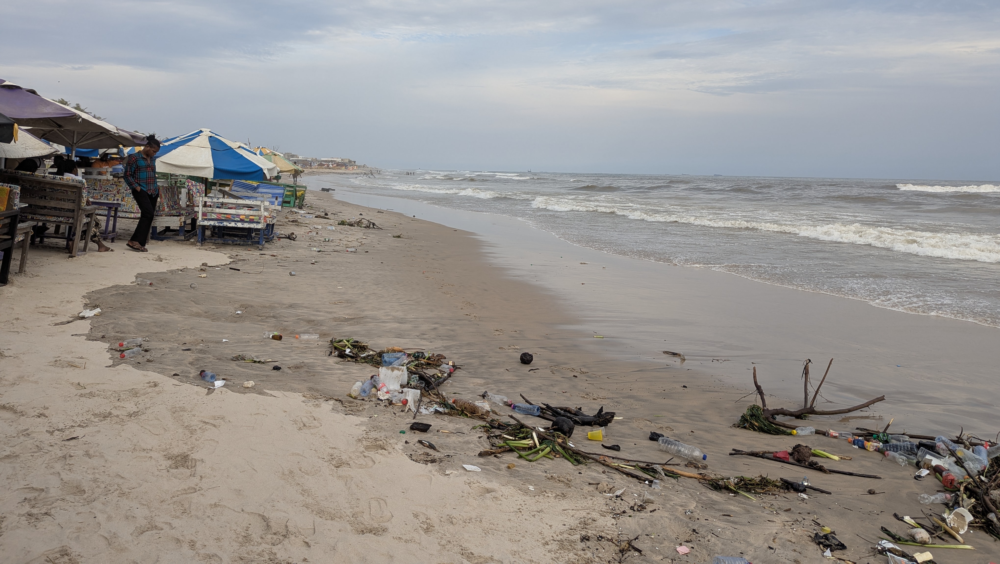
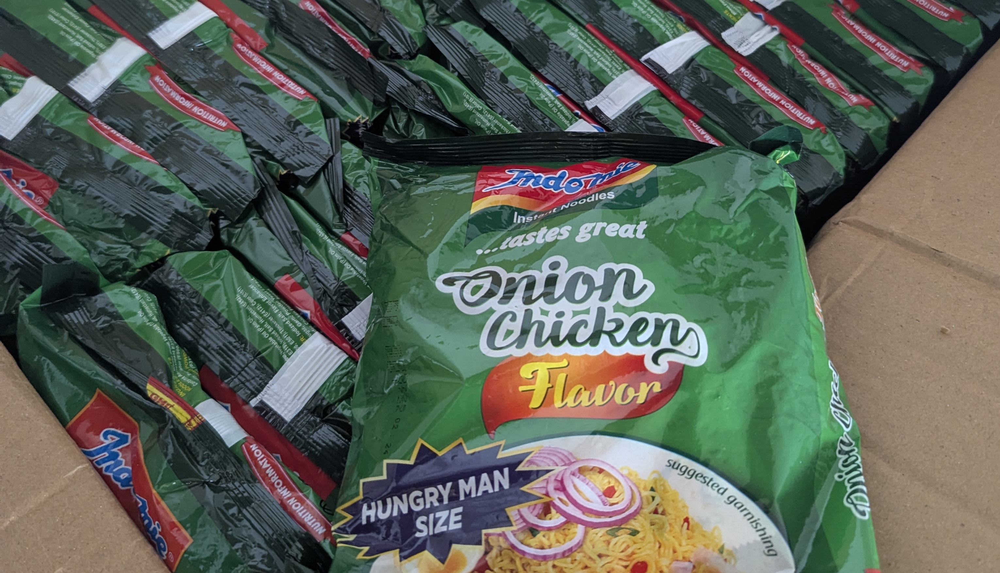
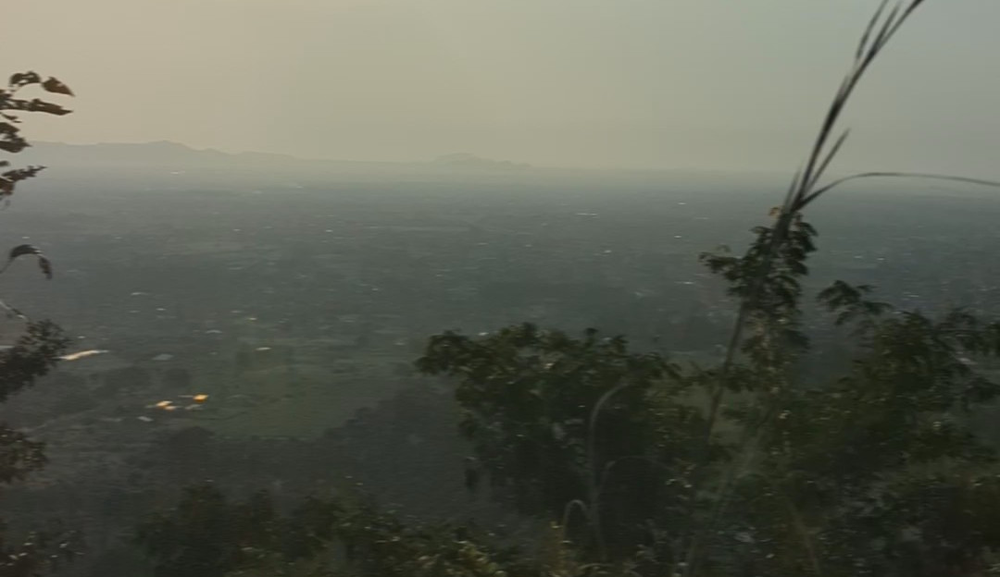

Unser nun schon dritter Monat in Ghana ging mit einer aktion für die Mädels im Projekt los. Die Mädels wurden in Kleingruppen mit anderen Mädels aus den verschiedensten Projekten motiviert ihre Ziele zu verfolgen. Es wurde vermittelt, das sie alles schaffen könne, wenn sie nur dran glauben. Dort haben wir dann auch unsere Mentorin getroffen, womit wir nicht gerechnet haben. Die Kinder von unserem Projekt haben sie auch sofort liebgewonnen. Während wir da waren ist eins der Mädels krank geworden, war aber am Ende des Tages schon wieder fit.
Am nächsten Tag, dem Sonntag, bekamen wir Besuch aus Shai Hills, einem Ort der ungefähr 15km entfernt liegt von anderen Freiwilligen aus Deutschland. Wir haben zusammen Nudeln mit Pfannenbrot und Dips gekocht, es anschließend gegessen und uns ganz viel unterhalten, bevor die beiden dann am Abend wieder zurückfahren mussten.

Gegen Ende der Woche, sind wir nach Ashaiman gefahren, da wir am Freitag früh zusammen mit unserem Ehemaligen Twi Lehrer, Senior Peter, nach Accra fahren wollten um Sehnswürdigkeiten anzuschauen. Als wir morgens aufgestand sind, hat es bereits angefangen aus Eimern zu schütten. Deswegen sind wir erst etwas später an unserem verinbarten Treffpunkt angekommen. Senior Peter war noch nirgendwo zu sehen. Deswegen mussten wir erst noch unter einem Dach über 1h warten. Er meinte zu uns, dass durch den Regen die Straße überflutet war und man da nicht langekommen ist - Eigentlich ist ab November die Trockenzeit, die Effekte des Klimawandels spürt man also auch bereits hier. 
Trotz des holprigen Starts, haben wir uns viele tolle Orte angeschaut, wie das Musem bei der Gedenkstätte des ersten Präsidenten von Ghana, Kwame Nkrumah, oder den Independence Arch. Nachmittags haben wir dann noch an einem Strand gegessen. Die Nacht haben wir dann nach einem Bofrot-Burger in einem Hostel in Accra verbracht. Am nächsten Tag wollten wir uns mit unserer Chefin Sister Portia treffen. Während wir gewartet haben, haben wir zufällig eine der Freiwilligen aus Shai Hills getroffen. Da Portia meinte, dass sie auch noch eine weil braucht bis sie da ist, sind wir mit ihr zu einem sehr großen Gebrauchtkleidermarkt gegangen. Irgendwann kam Portia dann in Accra an und wir haben nochmal 1h gebraucht bevor wir sie dann endlich an einem der drei ersten Ausgänge des Marktes gefunden haben. Zusammen waren wir noch ein bisschen Shoppen, bevor es dann wieder zurück nach Ayikuma ging.

In der Nacht habe ich, Johann, mich dann mehrmals übergeben und mir gings den ganze Tag über dreckig. Weil ich auch kaum Flüssigkeit in mir behalten konnte sind wir dann am Abend ins Krankenhaus gefahren. Im vergleich zu Deutschland war das Krankenhaus war nicht sonderlich schön und hygenisch. Wir waren uns einig das wir darauf verzichten können. Krankenhäuser, die besser ausgestatte sind, liegen weiter weg. Deswegen waren wir um so glücklicher als wir dann am Montag früh wieder zuhause in Ayikuma waren. Am nächsten Morgen hat sich dann Charlotte übergeben und diesmal bestand unsere Chefin drauf direkt um 8:30 Uhr zum Krankenhaus zu fahren. Ich blieb natürlich Zuhause weil ich immer noch krank war. Dort musste dann Charlotte Ewigkeiten warten und war dann gegen 17 Uhr wieder zuhause mit der Diagnose: Infektion. Den Rest der Woche waren wir einfach nur damit Beschäftigt wieder gesund zu werden.
Montag mussten wir dann zum Markt gehen, da wir neues Mehl brauchten und um Charlottes Sucht nach Indomie zu stillen.

Am nächsten Freitag haben wir mit den Kindern "Ich einfach unverbesserlich" geschaut. Der Film kam super an und hat alle zum Lachen gebracht. Samstag früh sind wir dann um 5:30 losgewandert, den Berg in der nähe hinauf. Dort haben wir dann auch den Kindern Haribo gegeben, welches wir aus Deutschland mitgebracht hatten. Das fanden die natürlich sehr cool. 

Am Sonntag sollte dann unsere Mentorin kommen, kam aber nicht. Dafür hat sie uns dann am Montag überrascht. Mit ihr haben wir dann viel geredet und sie meinte sie kommt uns bald nochmal wieder besuchen, bevor sie dann am Nachmittag wieder nach Accra gefahren ist.

Das letzte Wochenende im November haben wir beginnen lassen, in dem wir nach Shai Hills gefahren sind und uns da die Tiere im Naturschutzgebiet angeschaut haben. Dort hat uns Leandro, einer der drei Freiwilligen herumgeführt, bevor wir dann gemeinsam mit ihm und Yesa, einer anderen Freiwilligen wieder nach Ayikuma gefahren sind. Am Samstag ist dann noch die dritte Freiwillige, Sophia, nach gekommen und wir haben einfach gemeinsam das Wochenende genossen. Sonntag früh sind die Drei dann wieder zurück gefahren.

**Übrigens:** seit dem Wochenende werden auch automatisch alle Stories die auf Instagram erstellt werden auch hier in dem [Instagram Story Archiv](https://www.ghanastisch.de/instagram) hochgeladen. In den kommenden Tagen wird dies auch noch laufend verbessert.
