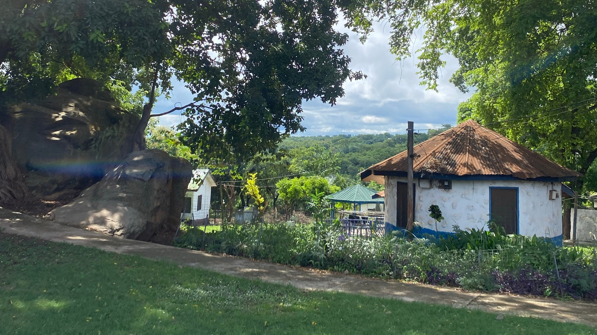
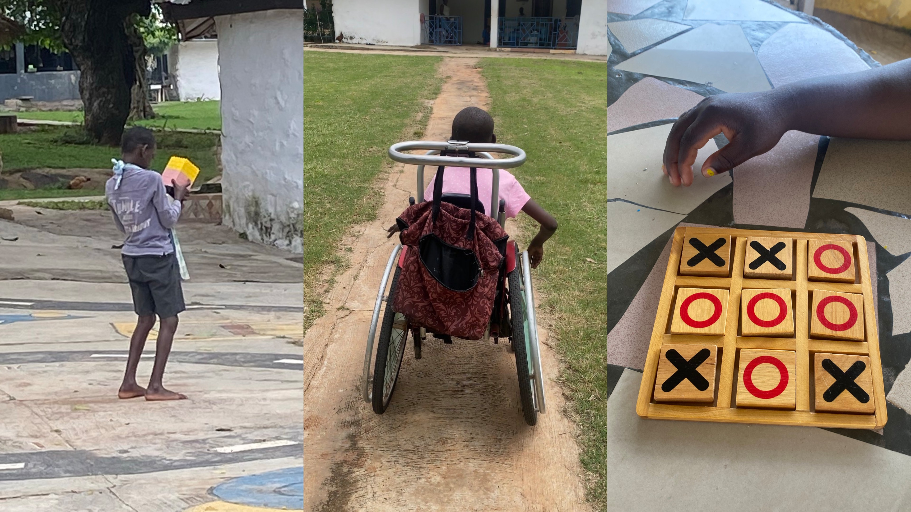
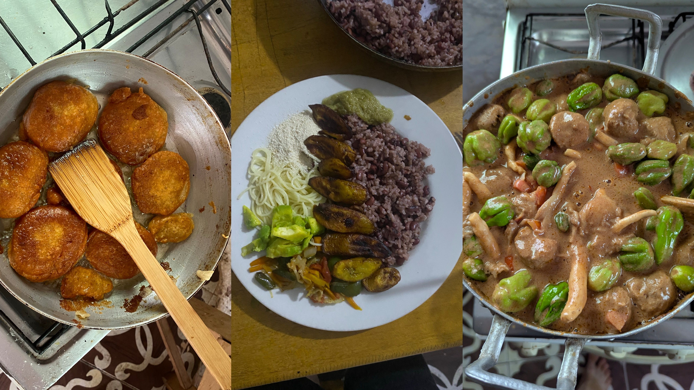
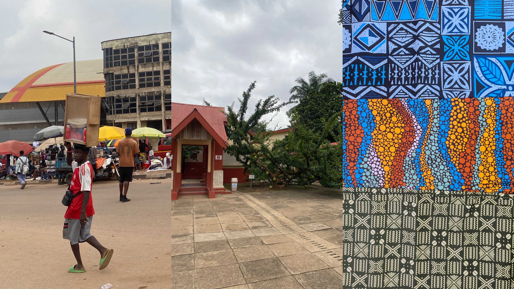
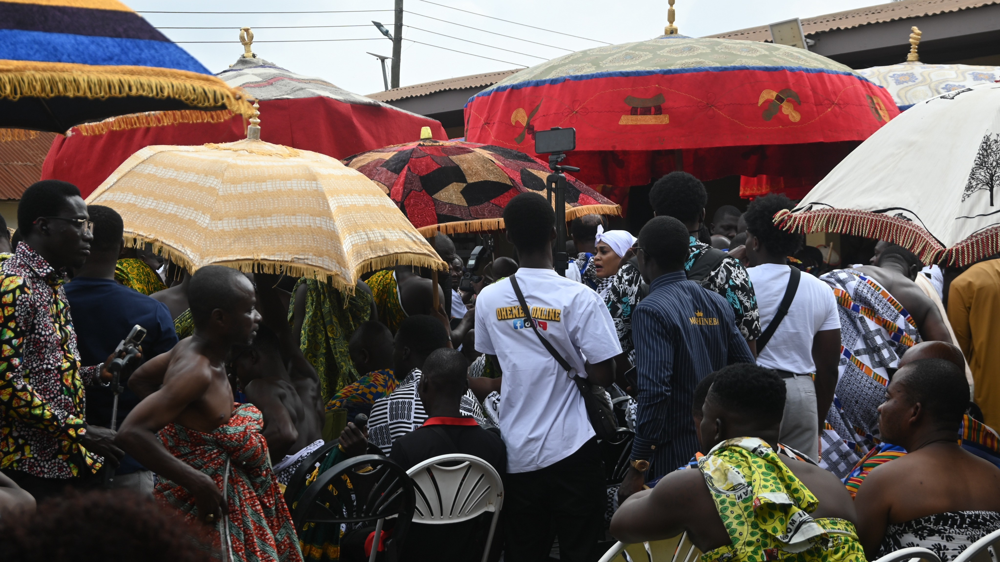
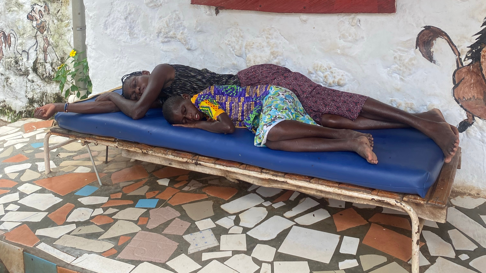

Unser vorletzter Monat in Ghana geht zu Ende. Nachdem wir Ende Juni Urlaub in Accra und in der
Volta Region am Meer gemacht haben, ging es weiter mit unserem normalen Alltag hier in PCC.
Langsam regnet es weniger, trotzdem ist uns momentan oft kalt, dabei wird es nie
viel kälter als 23 Grad.  

Bei der Arbeit in PCC gab es in diesem Monat keine besonderen Ereignisse. Der Alltag bleibt hier
immer relativ gleich, um den Bewohner\*innen Stabilität zu geben. Trotzdem ist immer etwas los.
Diesen Monat habe ich vor allem genossen zu sehen, was meine Kinder alles Neues lernen. Eines
der jüngeren, im Rollstuhl sitzenden Kinder, besteht in der Special Attention mittlerweile darauf,
sich selbst durch PCC zu bewegen. Das klappt nach einigen kleineren, aber nicht weiter
schlimmen Unfällen immer besser. Einer älteren Bewohnerin habe ich diesen Monat ein
Würfelspiel beigebracht. Sie hat sich so sehr gefreut, als sie verstanden hat, wie es funktioniert.
Ein anderes Kind hat einen „riesigen“ Legoturm gebaut und ist mega stolz damit durch die
Gegend gelaufen.

Diesen Monat gab es auch schon die ersten Abschiede. Nicht alle Bewohner*innen leben
dauerhaft hier, manche kehren für die Ferien zu ihren Familien zurück. So auch Blessing, mit der
ich die letzten zwei Monate Special Attention gemacht habe. Wir haben immer Memory, Domino,
Würfelspiele und Tic-Tac-Toe zusammen gespielt und dabei viel gelacht.
Außerhalb der Arbeit haben wir viel Zeit damit verbracht, ghanaisches Essen zu kochen und
Gebäck zu machen. Ich habe Waakye gekocht und Johann hat Groundnut Soup gemacht.
Zusammen mit einer ghanaischen Freundin haben wir Bofrot und Sweet Ba gemacht, beides sind
eine Art Quarkbällchen.

An einem Mittwoch haben wir uns außerdem frei genommen und sind nach Techiman zum
Wochenmarkt gefahren. Da haben wir vor allem Stoffe eingekauft. Natürlich durfte auch ein
Besuch in der Mall und bei KFC nicht fehlen, bevor es wieder durch die grünen Straßen zurück
nach Nkoranza ging.

Außerdem sind wir an einem Freitag nach der Arbeit für das Wochenende nach Kumasi gefahren.
Am Samstag sind wir ins Cultural Center gefahren, wo einige Gegenstände des Asantevolkes
ausgestellt sind. Die meisten davon haben früheren Königen gehört. Die Führung war echt
interessant. Leider durfte man keine Fotos machen. Danach ging es zum Markt, wo wir uns
erfolgreich auf die Suche nach Stoffen gemacht haben. Auf diesem über mehrere Etagen
verteilten Markt gibt es alles. Als ich nach Ghana gekommen bin, waren diese stark besuchten
Orte mit den verschiedensten Eindrücken immer mega anstrengend, mittlerweile liebe ich das.

Am Sonntagmorgen ging es für uns dann zum Manhyia Palace. Dort wohnt der Ashanti King und
es findet alle sechs Wochen das Akwasidae Festival statt. Als wir um 11 Uhr dort ankamen, war
noch nichts los. Trotzdem wurden wir direkt von einem Ghanaer angesprochen, der uns geholfen
hat, Stühle zu kaufen, sodass wir sitzend warten konnten. Nach und nach kamen mehr Gäste und
auch immer mehr der Chiefs. Irgendwann war es dann so weit: Alle standen auf und der König,
Otumfuo Osei Tutu II, zog ein. Dann sind nach und nach mehr Menschen nach vorne gegangen,
um den König zu grüßen. Alle haben sich, mit einigen Metern und ein paar Stufen Abstand, vor
dem König verbeugt und es wurden Geschenke präsentiert. Der König saß überdacht, umringt
von seinen Leuten, und rief einige Menschen für ein kurzes Gespräch zu sich nach vorne.
Irgendwann gegen 16 Uhr mussten wir dann leider gehen. Gerne hätten wir noch gewartet, bis die
neue Ashanti-Königin zum ersten Mal bei diesem Festival aufgetreten wäre, um den König zu
grüßen.

Nachdem im letzten September die Ashanti-Königin Nana Afia Kobi Serwaa Ampen II gestorben
ist, wurde Nana Yaa Akyaa II im Juni zur neuen Ashanti-Königin. Bei dem König und der Königin,
die auch Asantehene und Asantehemaa genannt werden, handelt es sich übrigens nie um Frau
und Mann. Hier wird das Erbe nämlich über die Linie der Mütter weitergegeben. Das heißt, die
Kinder des Königs werden nie den Thron besteigen, sondern nur die der Königin, falls sie vom
Ältestenrat für diese Rolle auserwählt werden.  
Nach einem kurzen Stopp im Hostel ging es für uns an diesem Tag wieder zurück nach Nkoranza,
da wir ja am nächsten Tag wieder arbeiten mussten.  
Jetzt ist schon unser letzter Monat hier in Ghana angebrochen und wir freuen uns, bald wieder
zurück in Deutschland zu sein und euch alle wieder zu sehen! Bis bald!

