Die erste Woche unseres Freiwilligendienstes ist um. Schon jetzt haben wir viel erlebt und viel
neues gelernt. Am Montag, den 1.09. ist Johann von Bremen und ich bin von Düsseldorf nach
Istanbul geflogen. Von dort aus ging’s dann gemeinsam weiter nach Accra wo wir von Dr Ben,
Sister Portia und Mr Robert herzlich in Empfang genommen wurden. Nach einem kurzen Stop bei
KFC (sieht genauso aus wie in Deutschland) haben wir uns gemeinsam mit Sister Portia auf den
Weg nach Ayikuma, zu unserem neuen Zuhause gemacht. Dort angekommen sind wir dann relativ
schnell müde in Bett gefallen.

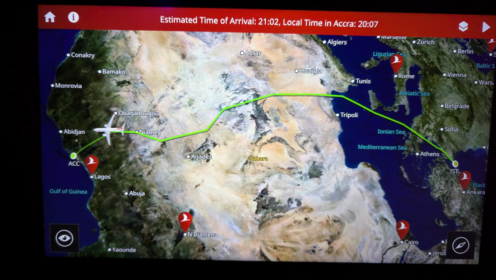 
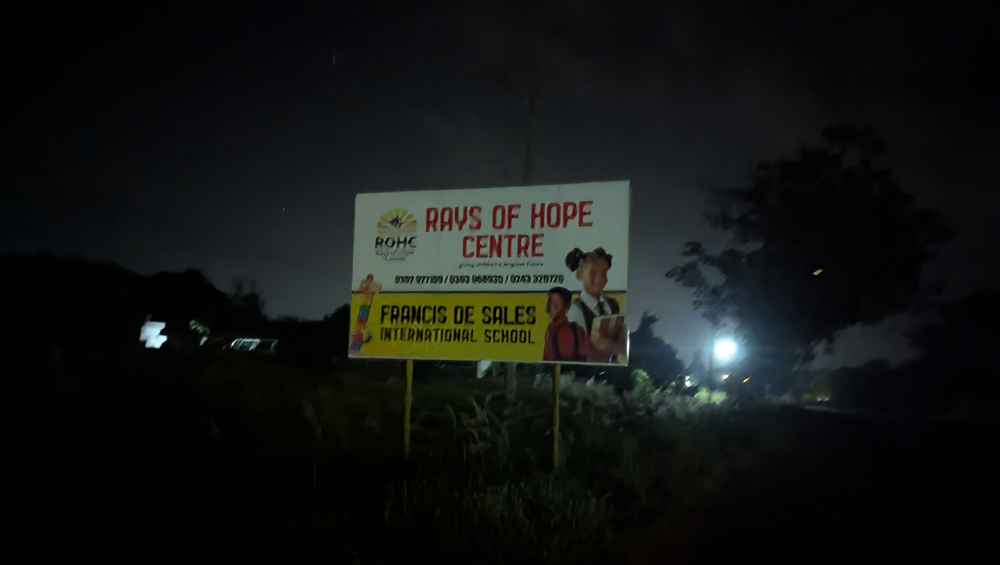

Nach einer erholsamen Nacht mussten wir dann am Morgen leider feststellt, dass der Wasser
Tank leer ist. Während wir auf den Sicherheitsmann des Projekts gewartete haben damit er die
Pumpe zum befüllen des Wassertanks anmacht, haben wir ausgepackt, Spaghetti von Auntie
Sandra genossen und wurden von Sister Portia einmal über das Gelände geführt. Als dann der
Wassertank voll war, wurde klar, dass auch die Pumpe nicht richtig funktionierte. Nach ein paar
anrufen kam uns dann ein Mitarbeiter des Projekts zur Hilfe, der einen Hebel umlegte damit die
Pumpe wieder läuft. Und dann war der erste Tag auch schon vorbei.

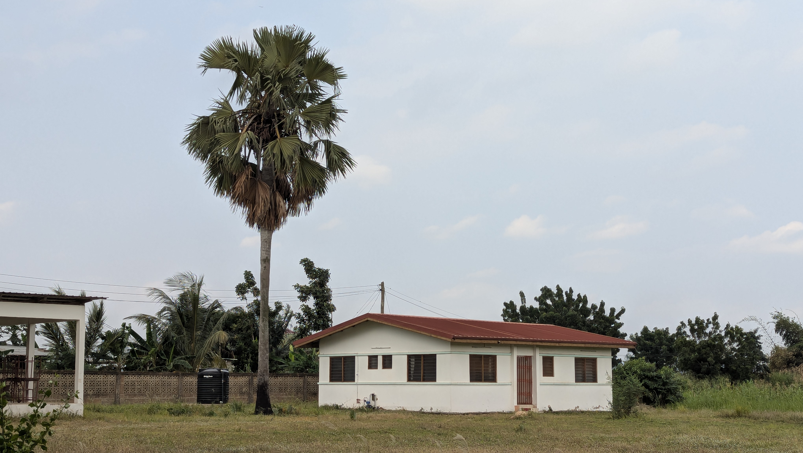 
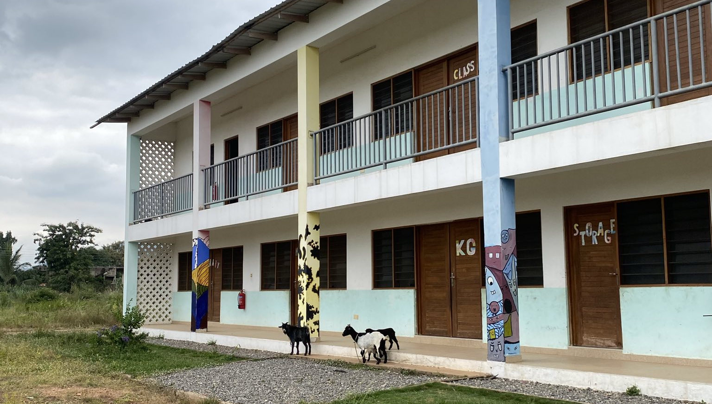
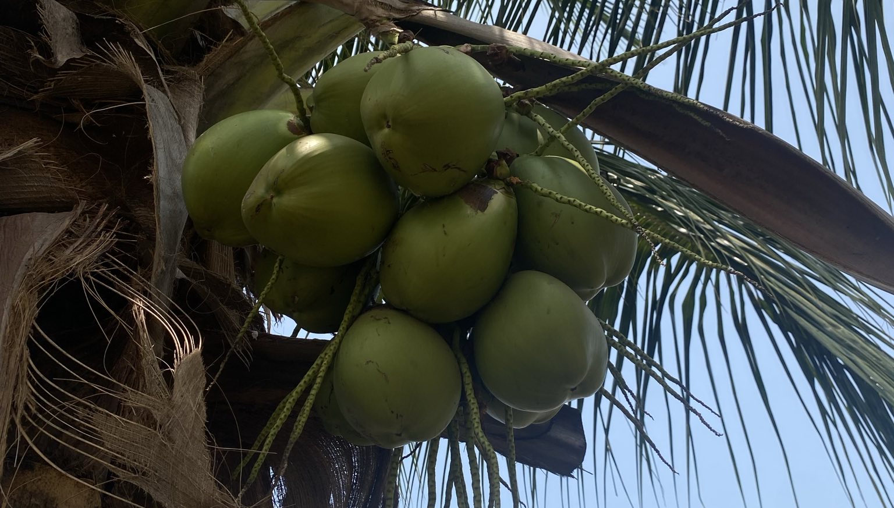

Am Mittwoch hat uns Sister Portia dann Ayikuma gezeigt. Ayikuma ist ein eher kleines Dorf, das
sich hauptsächlich entlang einer Straße befindet. An vielen Orten gibt es Stände die
verschiedenes Obst und Gemüse verkaufen. Beeindruckt hat uns auch wie viele Schulen es hier
im Verhältnis zur Größe des Dorfes gibt. Anschließend ging es noch mit dem TroTro, dem
ghanaischen Bus nach Dodowa zum Markt. Dort haben wir uns umgesehen und ein bisschen
Obst gekauft bevor wir mit dem Taxi wieder zurück zum Projekt gefahren sind.

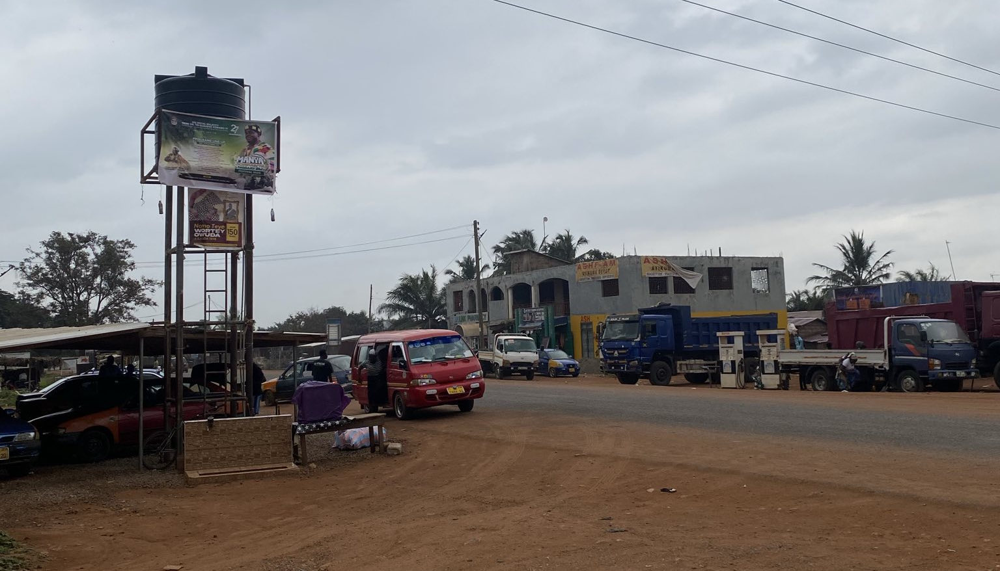
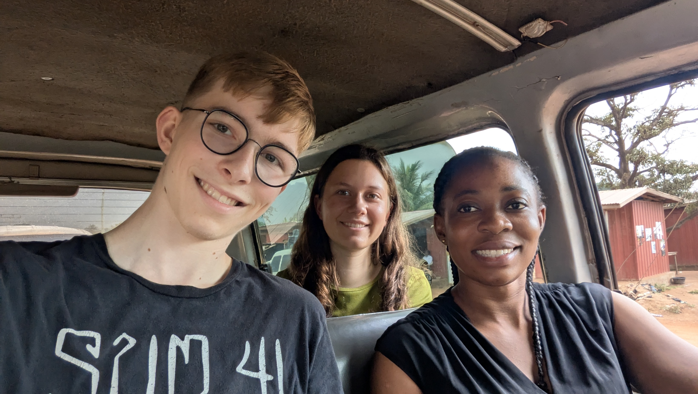

Donnerstag, ging es dann früh morgens zusammen mit Sister Portia mit dem TroTro los nach
Accra. Hier haben wir unsere Non citizen card erstellt mit der wir uns in Ghana ausweisen können,
eine ghanaische Simkarte gekauft und MoMo (MobileMoney), das ghanaische viel populärere
äquivalent zu Paypal, eingerichtet. Jetzt hatten wir auch endlich Internet. Nach einem Mittagessen
in der Accra Mall und einigen Einkäufen ging es dann in Richtung Markt. Auf dem Markt wusste
man gar nicht wo man hinsehen sollte, so viele verschiedenen Dinge wurden angeboten. Hier
haben wir Hefte, Bücher und einige andere Dinge für das Projekt gekauft. Über den Tag hinweg,
sind uns viele Menschen sehr herzlich begegnete, gleichzeitig sind wir auch vermehrt nach Geld
gefragt wurden. An letzteres müssen wir uns erstmal noch gewöhnen. Müde und voller neuer
Eindrücke ging es dann gegen 17 Uhr mit dem Taxi zurück nach Ayikuma. Im Stau auf dem
Heimweg mussten wir zum Glück nicht verhungern, denn man kann hier einfach aus dem Auto
heraus bei den ganzen Ständen am Straßenrand einkaufen - das ist ganz schön praktisch. Gegen
19:30 waren wir dann wieder in Ayikuma.

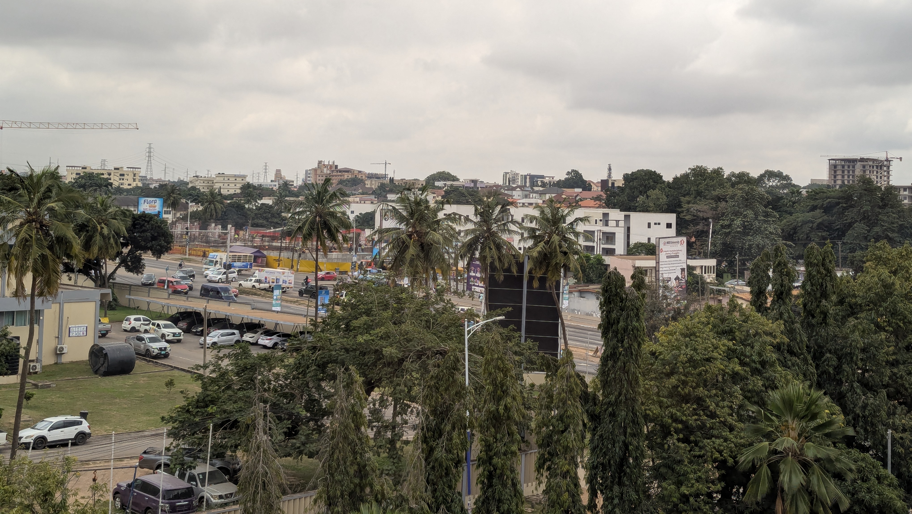
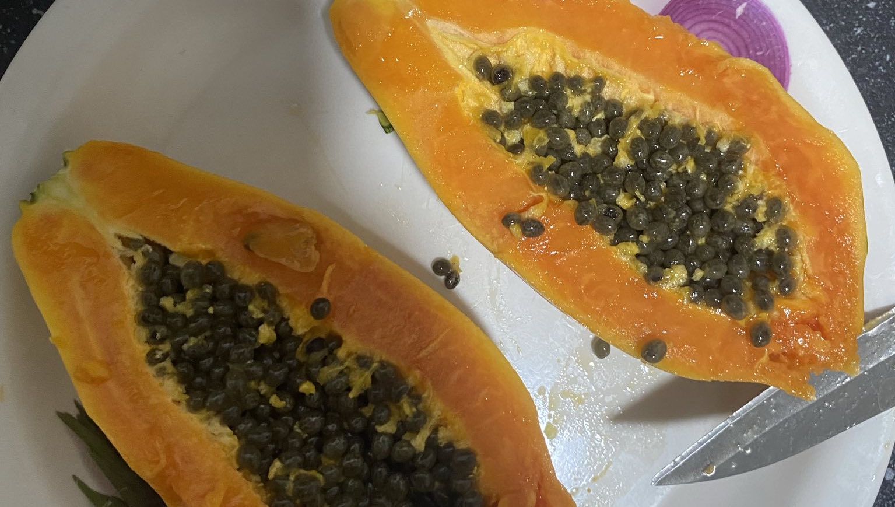

Freitag war ein eher entspannter Tag, wir haben ein paar Dinge mit Sister Portal besprochen und
dann zusammen noch ein paar Plakate aufgehängt um Lehrer für die Schule zu suchen. Zum
Mittagessen gab es Yam und Plantain, mit Stew mit Ei, gekochtes Ei und Salat (kleiner Sideefact
Unsere erste Palette mit 30 Eiern hat von Dienstag bis Samstag gereicht, das macht 3 Eier pro
Person pro Tag). Das war lecker.

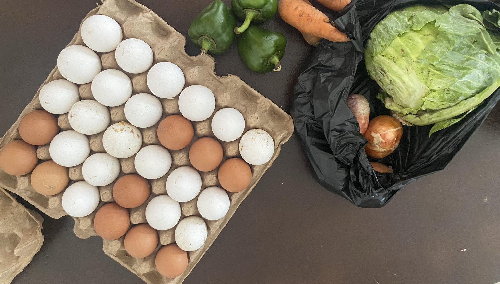
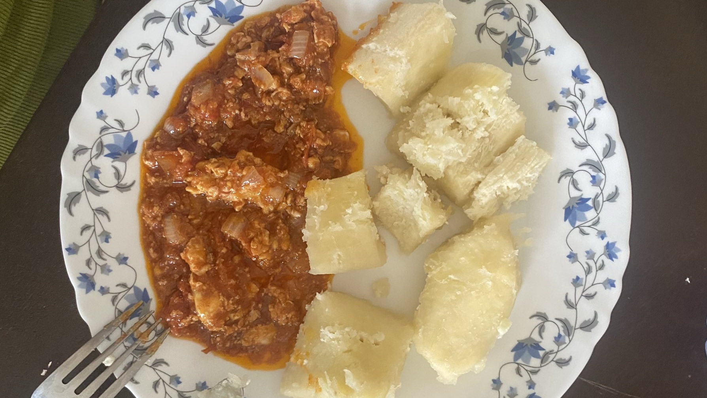
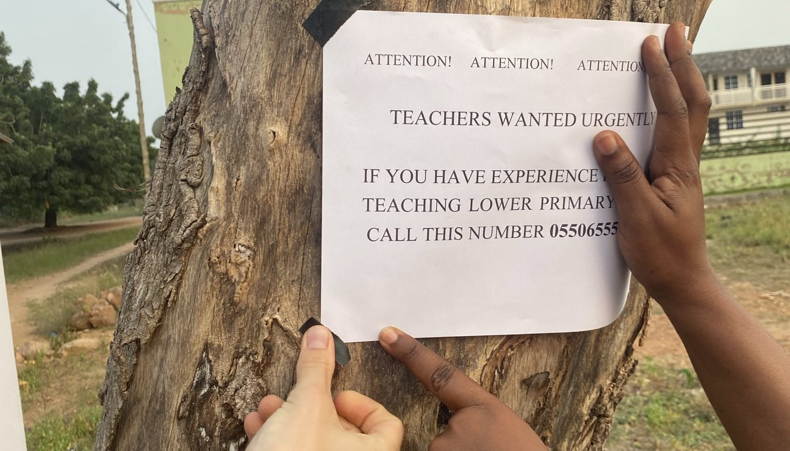

Am Samstag haben wir das Zimmer, der neuen Köchin des Projekts (und uns selbst) gelb
gestrichen. Mittags haben wir zusammen mit Sister Portia Indomie gekocht. Das sind
Instantnudeln gebraten mit diverse Gemüse und Ei.

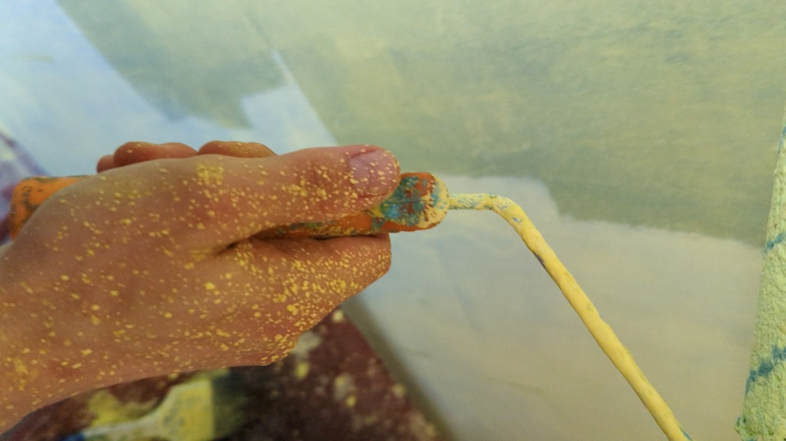

Sonntag ging es dann alleine auf dem Hau in die Kirche. Hier haben unseren ersten Gottesdienst
in Ghana erlebt und wurden von der Gemeinde sehr herzlich begrüßt. Auf dem Heimweg von der
Kirche haben wir dann die ersten Kinder aus dem Projekt getroffen - Das war schön.
Montag ging dann hier der richtige Alltag los. Morgens sind wir um 5:30 Uhr zur Devotion
gegangen. Hier beten und singen die Kinder gemeinsam. Danach haben wir bei uns gefrühstückt
bevor wir gegen 8 Uhr zur Schule gegangen sind. Dort haben wir den Vormittag mit den Kinder
verbracht, versucht Namen zu lernen und vor allem ganz viele Lieder auf unserer Musikbox
abgespielt. Zum Mittagessen gab es dann Reis mit Stew, Salat und Hähnchenschenkeln - unsere
bisheriges Lieblingsgericht von Auntie Sandra. Am Abend hatten wir dann noch eine
Errungenschaft zu feiern - wir haben das erste mal etwas alleine eingekauft und zwar (hier bitte
Trommelwirbel einfügen) eine Wassermelone. Und so schnell war unsere erste Woche in Ghana
auch schon vorbei. Wir freuen uns auf die Nächten 51 Wochen!

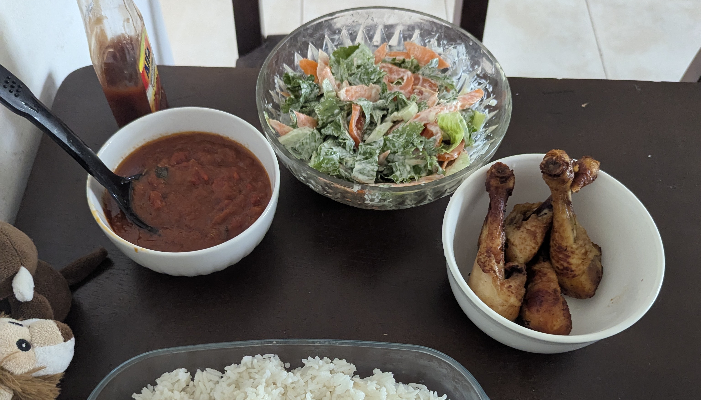
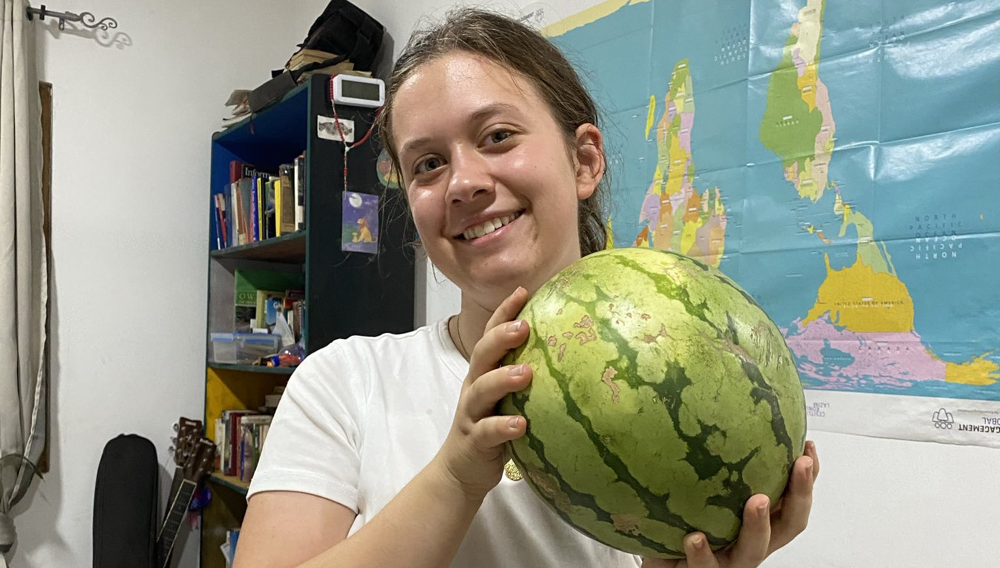
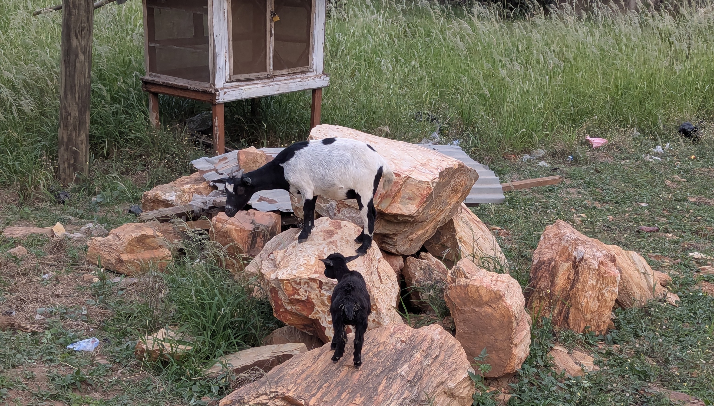

