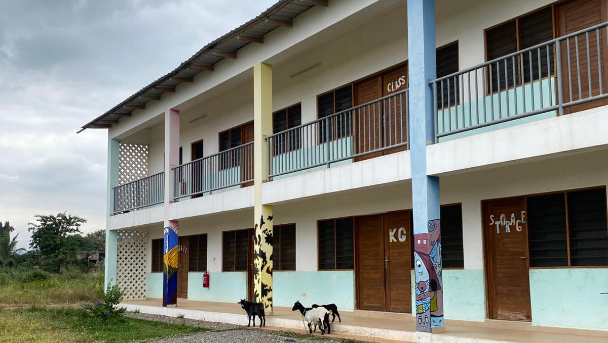
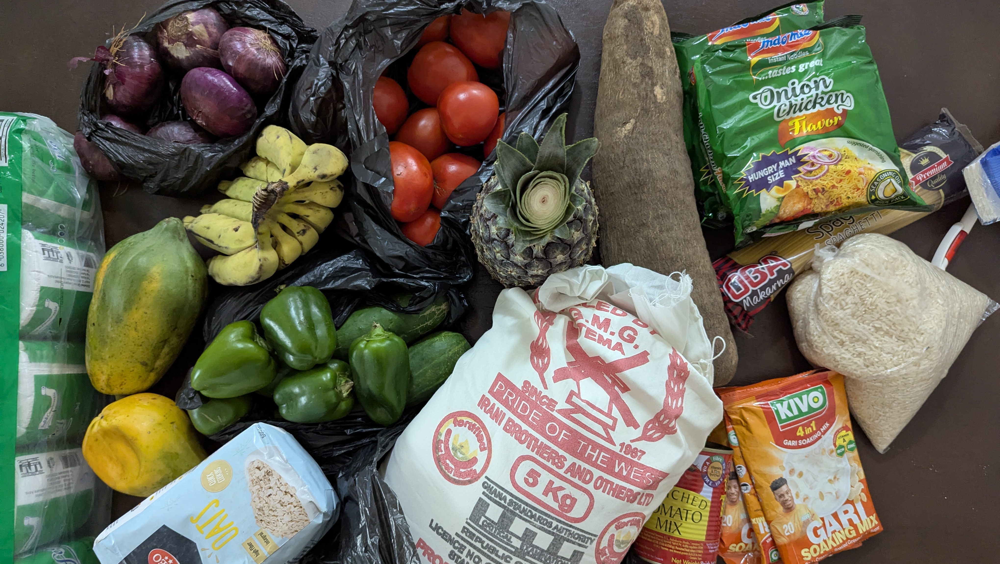
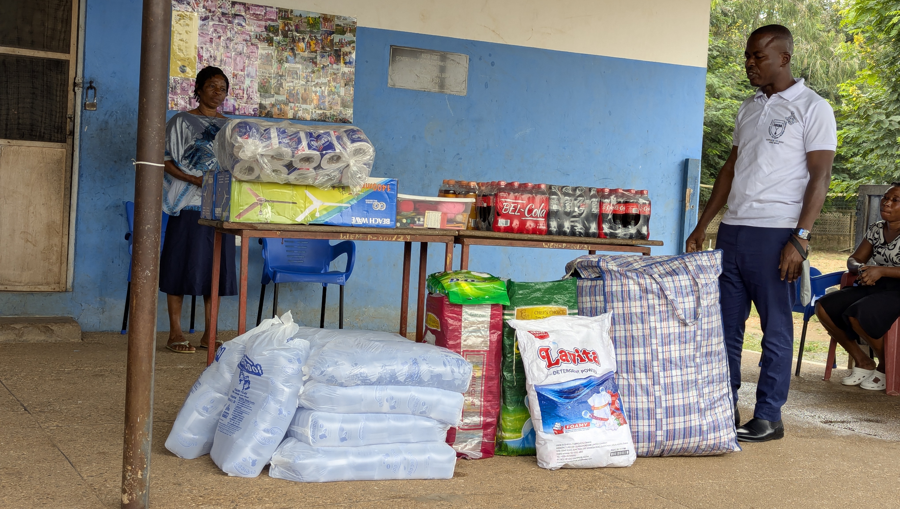
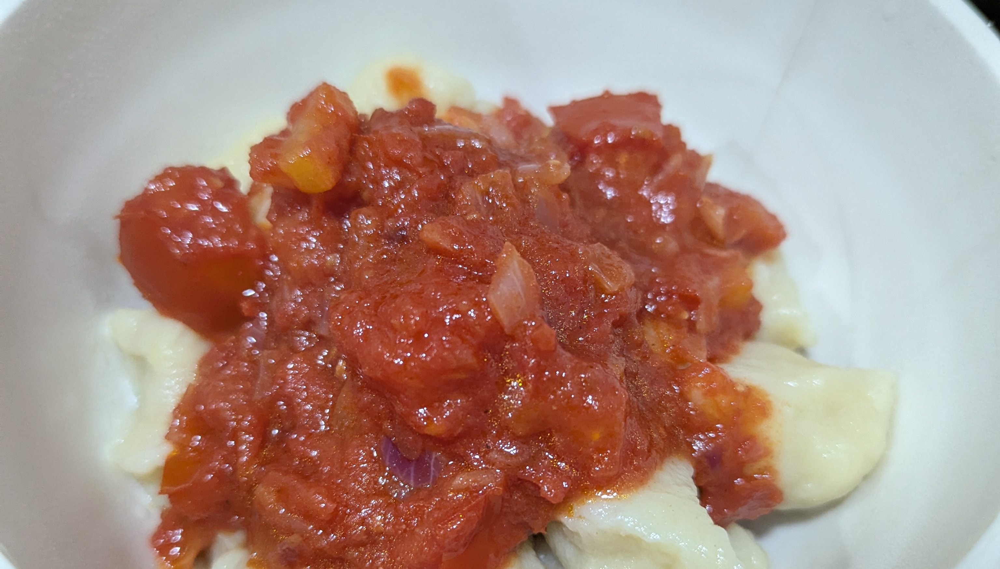
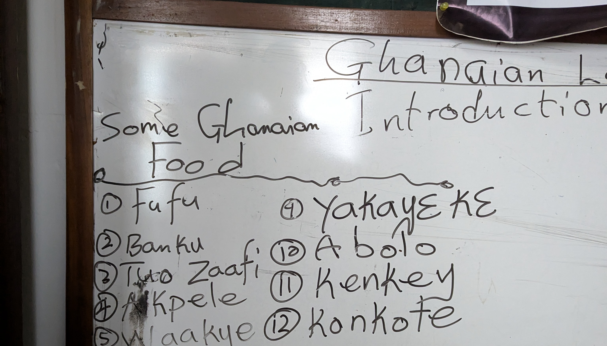
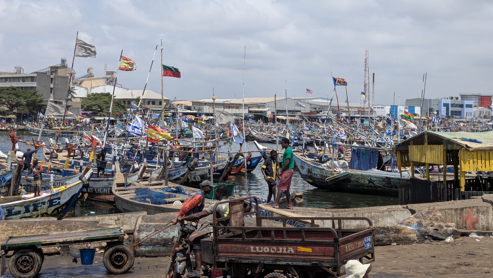
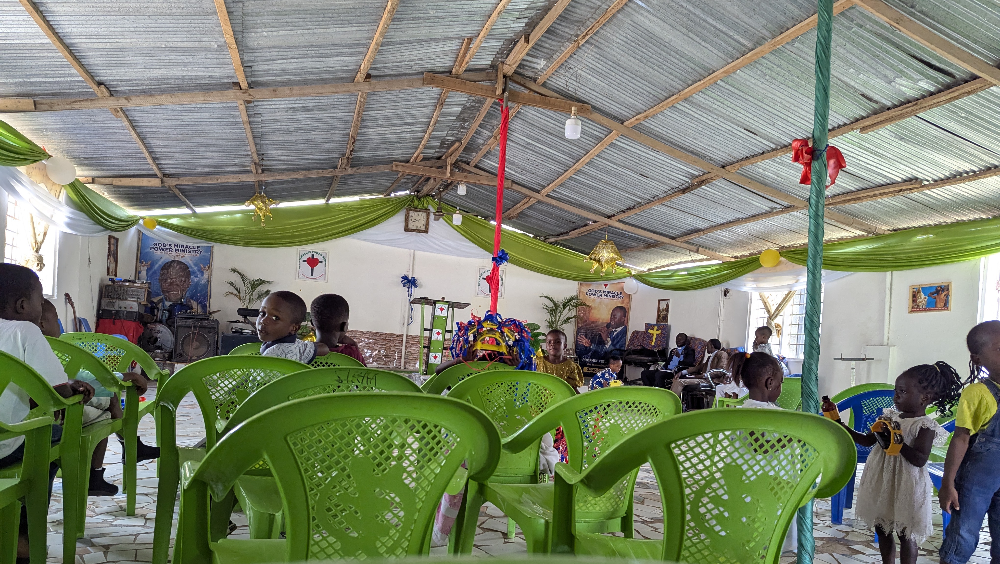
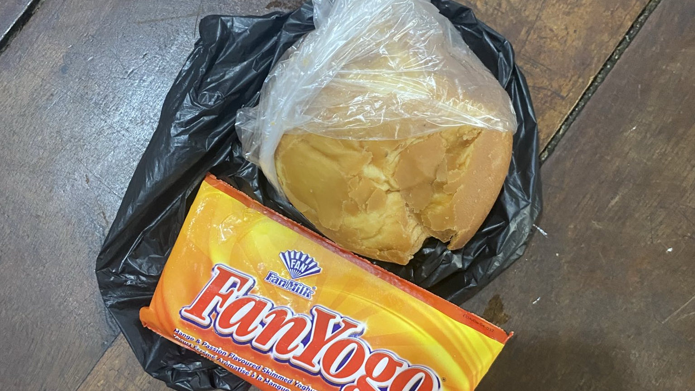

Jetzt sind wir schon vier Wochen in Ghana – Zeit für ein kleines Update von uns. *Dieser Bericht spiegelt natürlich nur unsere eigenen Erfahrungen und Erlebnisse wieder und kann keineswegs so auf die Ghanaische Bevölkerung übertragen werden.* Die zweite Woche begann damit, dass die Schule wieder anfing und die Kinder aus dem Projekt entweder zu Schulen in Ayikuma, dem Dorf, in dem das Center liegt, gingen oder, wenn sie in der zweiten oder dritten Klasse sind, die Schule im Projekt besuchen. Dort sind auch ein paar Kinder von außerhalb, aber trotzdem ist die Schule mit elf Schülerinnen und Schülern doch ziemlich klein. Dennoch sollte man sie nicht unterschätzen: Lärm und Unruhe stiften können sie nämlich prima, lesen teilweise auch.

Am Anfang war in der Schule noch alles ziemlich chaotisch: Schreibhefte mussten verteilt, alles musste saubergemacht werden und so weiter. Wir waren dann den Rest der Woche ab und zu beim Unterricht dabei und haben den Kindern Fragen beantwortet, wie man zum Beispiel „the“ oder „a“ schreibt. Außerdem konnten wir nach und nach auch schon die ersten Namen lernen, auch wenn ich bis heute nicht alle kenne.

Donnerstag war Markttag in Dodowa und wir entschieden uns, dorthin zu fahren, da wir noch Lebensmittel für das Wochenende benötigten. Als dann niemand mit uns mitfahren konnte, beschlossen wir, dass wir eben alleine fahren müssen. Die Menschen an der Ayikuma Junction, dem Ort, wo alle Tro-Tros in Ayikuma abfahren, haben uns dann auch freundlicherweise geholfen, das richtige zu finden. Dort angekommen, waren wir zuerst von der Größe des Marktes überwältigt. Nachdem wir dann so einiges besorgt hatten, sind wir wieder zurück nach Ayikuma gefahren und waren noch den Rest des Vormittags in der Schule.
Freitag war dann unser freier Tag, an dem wir nichts Besonderes gemacht haben.

Samstagvormittag kam dann ein Bus mit einer Kirchengruppe. Diese brachte Spenden wie Kleidung, Bücher, Wasser und Stifte mit. Nach mehreren Motivationsreden, in denen wir unter anderem auch als Heilige bezeichnet wurden, mussten natürlich auch noch Fotos gemacht werden. Nachmittags haben wir dann Gnocchi aus Yam, einer Kartoffel ähnlichen Wurzel, gemacht. Es hat 1a geklappt und genau wie Gnocchi geschmeckt. Am nächsten Morgen, dem Sonntag, ging es natürlich wieder in die Kirche. Diesmal waren die Kinder dabei und sind auf uns eingeschlafen. Deswegen konnten wir *leider* nicht aufstehen, um Spenden in die Box zu werfen. Unser Highlight bei dem Kirchenbesuch war aber die Versteigerung während des Gottesdienstes – und da fanden wir die Frau am lustigsten, die ein lebendiges Huhn aus einer Plastiktüte holte und dann damit tanzte.

Die nächste Woche war weniger spektakulär; wir sind einfach mitgelaufen, waren beim Unterricht dabei und haben uns ansonsten selbst beschäftigt, bis wir Donnerstag nach dem Mittagessen nach Ashaiman gefahren sind. Im Gegensatz zu Ayikuma ist Ashaiman eine relativ große Stadt, in der auf jeden Fall mehr los ist. Charlotte fand es am Anfang schrecklich, aber inzwischen hat sie sich daran gewöhnt. In Ashaiman befindet sich ein anderer Standort unseres Projekts. Allerdings wird dieser aktuell nur von sechs Kindern genutzt, die dort „Prep“, also eine Art Hausaufgabenbetreuung, machen. Die anderen 21 Kinder, die über Rays of Hope da zur Schule gehen haben entweder einen so weiten Weg, dass es sich nicht lohnt oder sind alt genug um zu entscheiden ob sie kommen wollen oder nicht. Dort findet aber auch unsere „Twi and Culture Class“ statt. Twi ist eine Sprache, die hier in der Region viel gesprochen wird, deswegen lernen wir sie ein bisschen, damit wir zumindest auf dem Markt auf Twi einkaufen können. Außerdem vermittelt uns Senior Peter, unser Lehrer, auch noch ein wenig Landeskunde.

Freitagvormittag sind wir dann mit Fuseini, dem zurzeit einzigen Mitarbeiter in Ashaiman, zum Post Office und nach Tema zum Fischmarkt gefahren. Das zu sehen war ziemlich toll. Auf den Booten konnte man alle möglichen Flaggen wie zum Beispiel auch eine BvB oder FC Bayern München Flagge finden. Nachmittags hatten wir dann wieder unsere Twi and Culture Class. Für den darauffolgenden Tag hatte uns Senior Peter in seine Kirche eingeladen, da diese ihr neunjähriges Jubiläum feierte. Leider bestand diese Feier aus einem fünf- bis sechsstündigen Gottesdienst ohne Pause bei einer Lautstärke von ca. 105 dB. Immerhin haben wir danach Essen bekommen: Charlotte hat Reis mit Stew gegessen und ich habe Fufu mit Light Soup probiert. Mein Fazit: Fufu ist lecker, aber Light Soup war eines der schlimmsten Dinge, die ich je gegessen habe. Angeblich ist der Trockenfisch darin eine Delikatesse. Am Sonntag waren wir natürlich auch wieder im Gottesdienst; diesmal war die Lautstärke erträglicher und es gab Displays, auf denen Text zum Mitsingen angezeigt wurde. Da es der dritte Sonntag im Monat war, war es eine lange Messe, die mit drei Stunden aber noch im Rahmen lag.

Montag waren wir, bevor es wieder zurück nach Ayikuma ging, noch bei Dr. Ben zu Hause. Dr. Ben ist eines der Board-Member, also Mitglied des Vorstands von Rays of Hope. Er ist, genauso wie die anderen Vorstandsmitglieder, ehrenamtlich bei Rays of Hope aktiv. Da es aktuell keine Leitung gibt, übernimmt das Board zum Teil diese Aufgaben. Deswegen haben wir mit ihm über die Probleme gesprochen, die wir zu dem Zeitpunkt hatten, und dabei aus Kokosnüssen getrunken. Wir alle fanden das Gespräch aufschlussreich und sind motivierter daraus hervorgegangen.

Ab Dienstag ging dann der normale Schulalltag los – Montag war nämlich Feiertag und alle hatten frei – und wir haben angefangen zu unterrichten. Charlotte unterrichtet Englisch, Französisch und den praktischen Teil von Creative Arts, also so etwas wie Kunst. Ich habe Naturwissenschaften, Mathe und Computing, dessen deutsches Äquivalent Informatik wäre, übernommen. Am Nachmittag von 16 bis 18 Uhr sind wir dann auch bei der Prep dabei. So sah dann unsere Woche bis Donnerstag aus, an dem wir wieder nach Ashaiman gefahren sind.

Dort haben wir dann am Freitag und Samstag wieder fleißig Twi gelernt, sodass wir jetzt nicht nur „Danke“ und „Willkommen“ sagen können, sondern auch schon „Ich liebe Schuhe“ oder „Ich gehe nach Hause“. Sonntag waren wir wieder in der Kirche und haben uns danach Bofrot – ein Teigball, der ein bisschen ähnlich wie Quarkbällchen schmeckt, aber fester ist – und Mangoeis geholt. Nachmittags ging es auch schon wieder zurück nach Ayikuma, damit wir ab Montag wieder unterrichten konnten.

