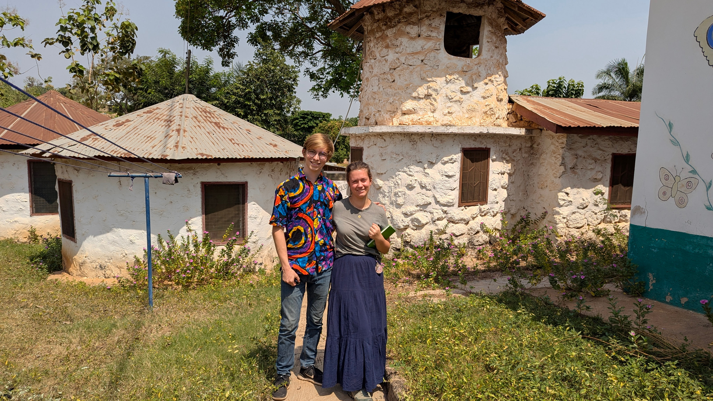
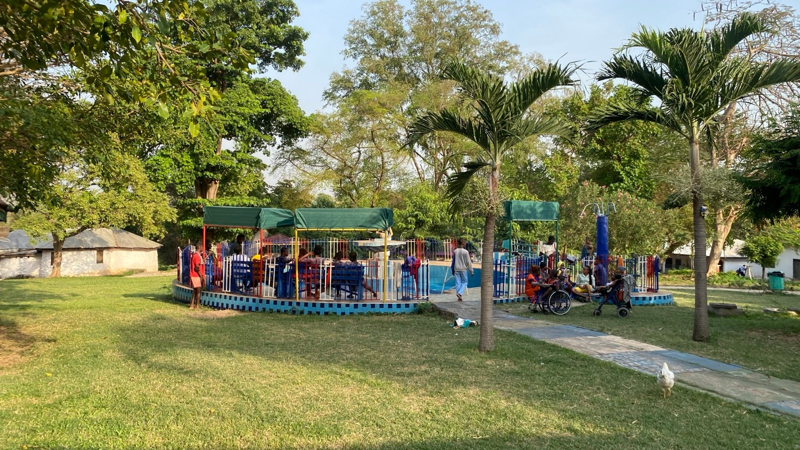
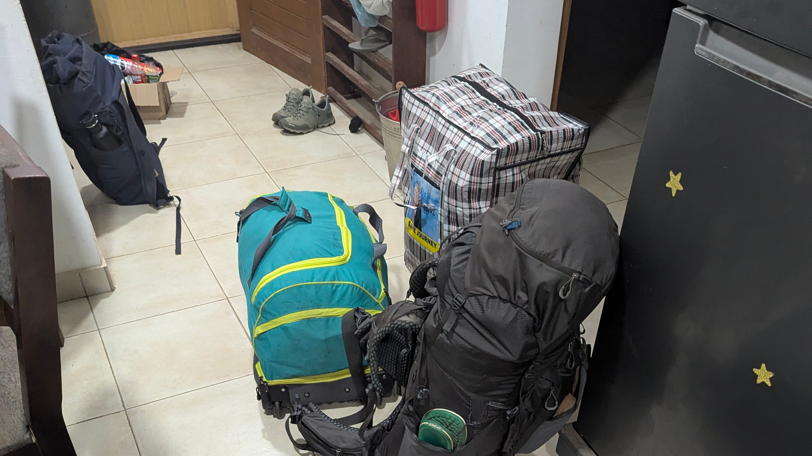
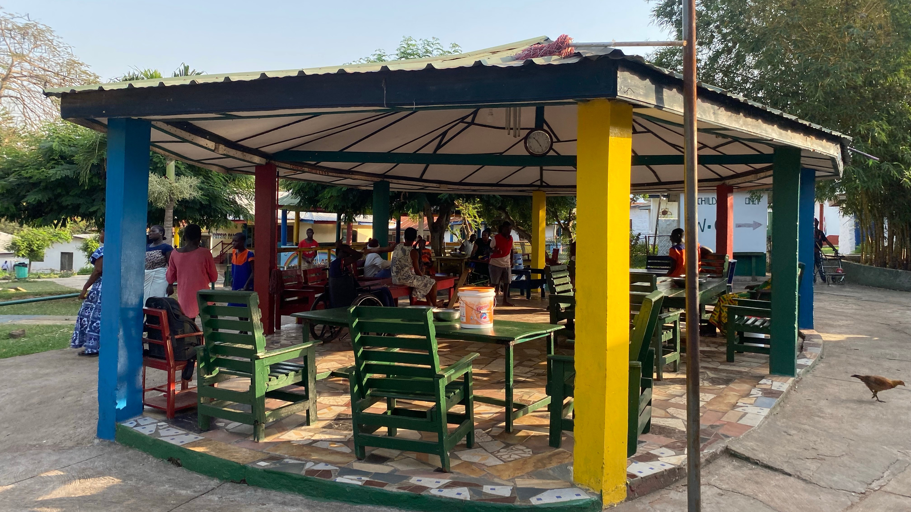

Hallo nach Deutschland, 

Lange haben wir uns hier nicht mehr gemeldet.   
Das hat einen guten Grund. Ende letzten Jahres war im Rays of Hope Center viel im Umbruch. Es gab viele neue Mitarbeiter*innen, so dass sich das Team erstmal neu finden musste und Aufgaben neu verteilt wurden. Für uns als Freiwillige war es in dieser Zeit schwierig unseren Platz zu finden. Nach langen hin und her haben wir uns dann schweren Herzens dazu entschieden das Projekt zu wechseln. 

Bei unserer Suche nach einem neuen Einsatzort sind wir auf die Peace of Christ Community (in Holland/Europa auch Hand in Hand) gestoßen und haben uns dazu entschieden unseren Freiwilligendienst dort fortzusetzen. Dieses Projekt wurde 1992 von einer Niederländischen Tropenmedizienerin gegründet und bietet heute 90 Kindern und Erwachsenen mit geistiger und körperlicher Behinderung ein Zuhause. Mittlerweile hat ein Niederländisches Ehepaar die Leitung übernommen. 

Anfang Februar sind wir dann umgezogen. Seit dem beginnen unsere Arbeitstage (Montag bis Freitag) um 7 Uhr mit einem Morgenspaziergang über das Gelände. Anschließend helfen wir beide jeweils einem Kind beim Frühstücken. Um 9 Uhr startet dann unsere Hauptaufgabe, die sogenannte Special Attention. Das heißt wir haben jeder 7 Kinder mit denen wir einzeln jeweils 30 Minuten über den Tag verteilt etwas machen (5 morgens, 2 Nachmittags). Was genau entscheiden wir individuell - von Malen, über Puzzeln und Gesellschaftsspielen bis hin zu lesen lernen ist alles dabei. Um 12 Uhr gibt es Mittagessen, da füttern wir wieder “unser” Kind. Danach ist bis 15 Uhr Mittagspause bevor wir nochmal eine Stunde Special Attention machen. Beim Abendessen gegen 17 Uhr sind wir dann auch wieder dabei. 

Diese Arbeit erfüllt uns beide sehr und wir sind sehr froh einen Teil unsere Zeit in Ghana hier verbringen zu dürfen. Natürlich denken wir weiterhin viel an das Rays of Hope Center und hoffen, dass sich dort alles wieder so zusammenfindet, dass Freiwilligenarbeit dort in Zukunft wieder einen Platz finden kann. 

Uns bleiben jetzt noch 3 Monate hier in Ghana. Ich denke es werden noch ein paar Beiträge kommen bei denen wir vielleicht auch ein bisschen aus den letzten Monaten berichten. Falls ihr Fragen habt, meldet euch gerne auf Instagram bei @ghanastisch. 

Liebe Grüße aus Ghana, 
Johann und Charlotte