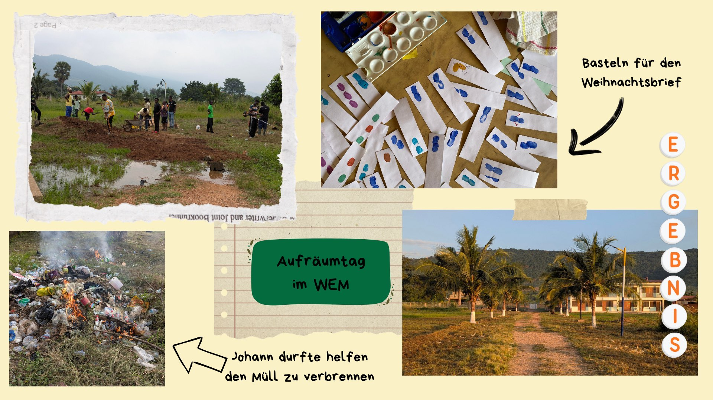
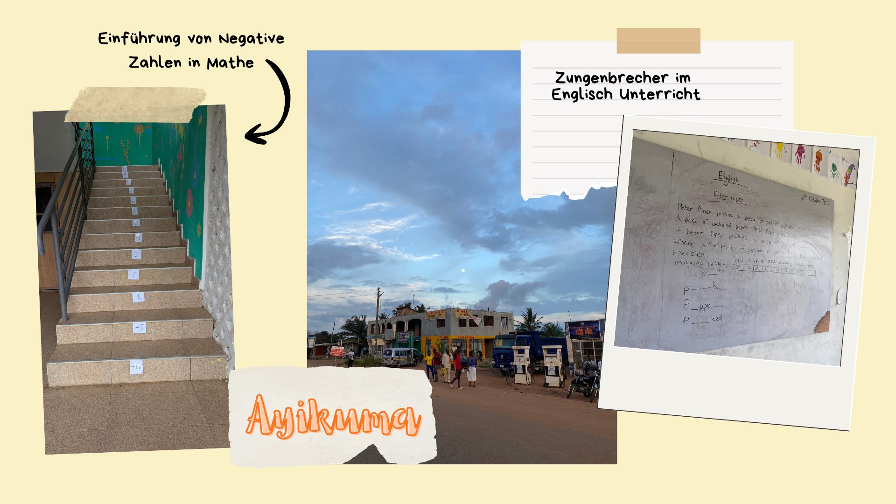
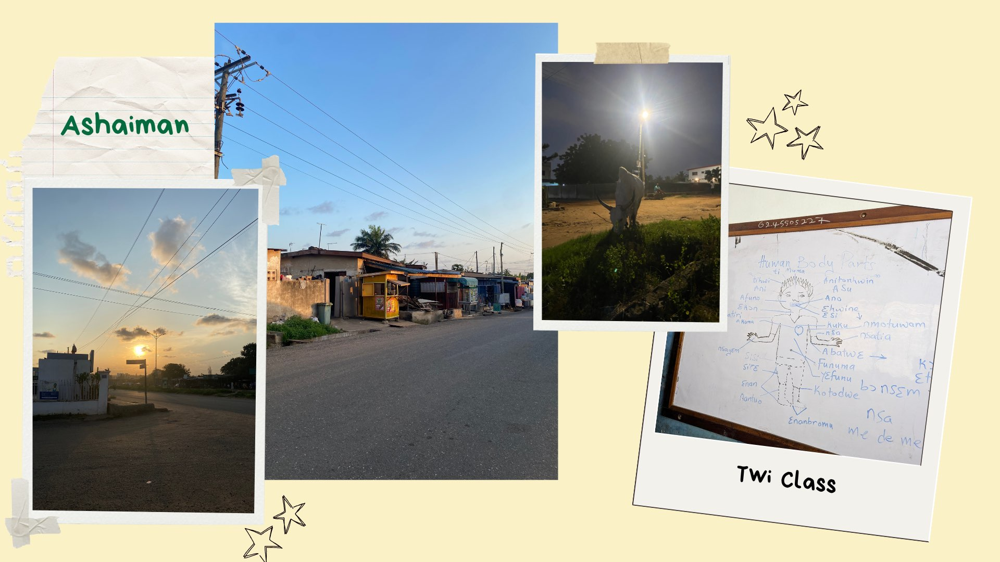
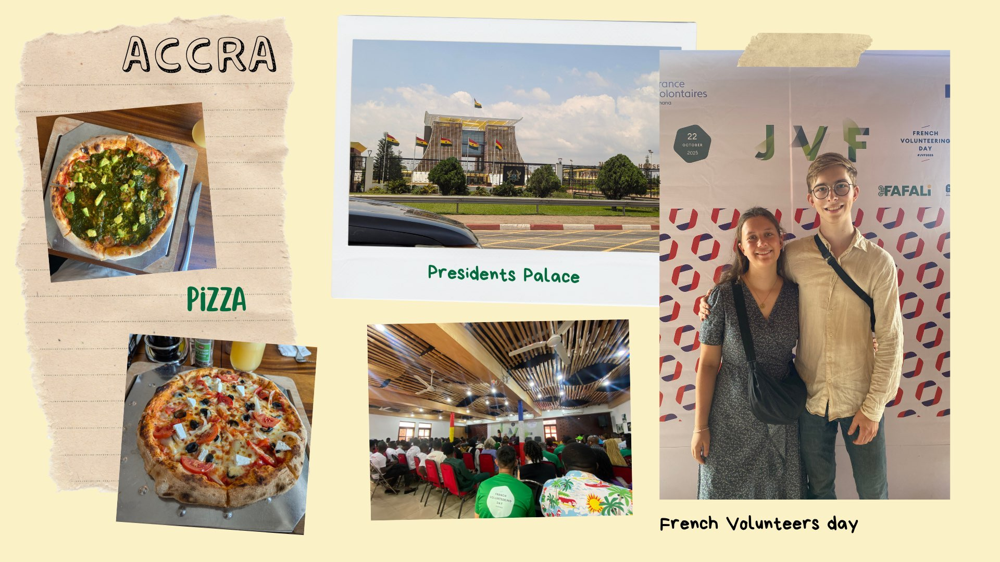
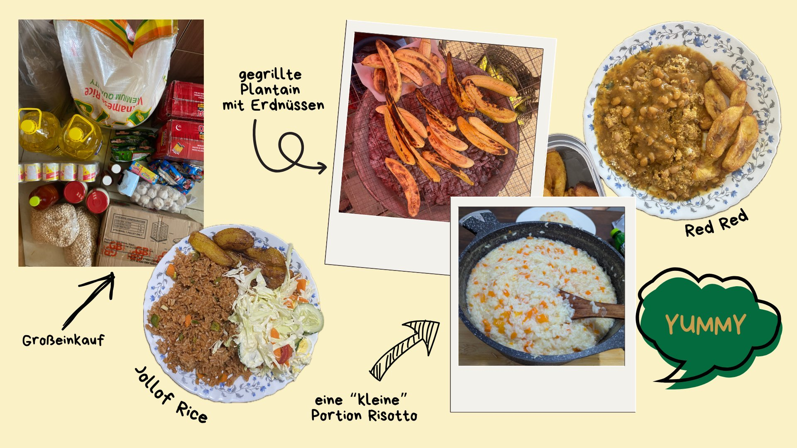

Wer hätte es gedacht?! Auch im 2. Monat hier in Ghana ist mal wieder Mega viel passiert. Langsam aber sicher haben wir einen richtigen Alltag und einige Routinen - wie das Bananenbrot backen jeden Dienstag - entwickelt.

Während uns unsere Umgebung und der ghanaische Lifestyle immer vertrauter wurde, gab es im Projekt in diesem Monat einige Veränderungen. 2 neue Betreuer*innen haben angefangen hier zu arbeiten und bereichern jetzt das (mit uns) 8 köpfige Team in der Schule und im WEM Center, hier in Ayikuma, Außerdem haben wir diesen Monat damit angefangen jeden Morgen die Zimmer der Kinder zu kontrollieren und zu schauen ob alles ordentlich aufgeräumt wurde. Dafür verteilen wir Punkte und es gibt immer vor den Ferien einen Preis für das Ordentlichste Zimmer. Damit auch das Gelände von RoHC hier in Ayikuma schön und ordentlich bleib wurde in diesem Monat ein Aufräum-Tag von einigen ehemaligen Projektkindern organisiert. An dem Samstag wurde Mais geerntete, den Palmen wurde ein Anstrich verpasst und der Weg zum WEM-Center wurde ausgebessert sodass man auch bei/nach Regen nicht durch tiefe Pfützen laufen muss um dort hin zu kommen. Das Gras wurde auch geschnitten, teilweise mit einem Rasenmäher und teilweise von Hand mit einem Cutlass. Beendet wurde der Tag nach einem gemeinsamen essen mit gemeinsamen singen und beten. Ende des Monats haben wir dann noch gemeinsam mit den Kindern für den Weihnachtsbrief von Aktion Lichtblicke gebastelt. Dafür haben wir mit den Kids einige Fingerabdrücke gemacht. Was genau wir gebastelt haben, verraten wir an dieser Stelle noch nicht, aber vielleicht kann es sich der ein oder andere ja denken.

In der Schule war in diesem Monat nicht viel besonderes los. Wir haben einen Teil unserer Unterrichtsfächer an die neuen Mitarbeiter abgegeben. Johann unterrichtet jetzt noch Computing in Klasse 2 und 3 und Science in Klasse 2. Ich unterrichte noch Französisch in beiden Klassen und Kust in Klasse 3. Manchmal ist das unterrichten ganz schön anstrengend. Viel Zeit verbringt man damit die Kinder Darm zu bitten sich wieder auf ihren Platz zu setzten, leise zu sein oder die aufgaben zu beginnen. Nach so mancher Stunde bin ich echt froh, dass in unserer Schule nur 5 Schüler in jeder Klasse sind.

Auch diesen Monat hatten wir weiterhin unsere Twi Classes mit Senior Peter in Ashaiman. In diesem Monat haben wir die Körperteile gelernt und wie man auf dem Markt einkauft. Jetzt ist unsere Twi class auch schon vorbei, nach dem wir die Abschlussprüfung auf dem Markt, in Senior Peters Begleitung, auf Twi einkaufen bestanden haben. Wir verstehen zwar immer noch nicht viel, aber wir stehen ja auch erst ganz am Anfang unserer Twi-Lern Reise. Um nach Ashaiman zu kommen sind wir natürlich oft mit dem Trotro gefahren - so oft, dass die Menschen die in Oyibi, wo wir immer umsteigen, und mittlerweile schon kennen und wissen wohin wir fahren.

Für ein Info Treffen mit anderen Deutschen Freiwilligen ging es Anfang des Monats nach Accra. Nachdem wir uns mit ganz vielen Menschen ausgetauscht haben, sind wir mit einer großen Gruppe in ein italienisches Restaurant gegangen und haben gemeinsam Pizza gegessen. Ende des Monats sind wir noch zweimal nach Accra gefahren. Einmal waren wir beim Immigration Office um uns nach den benötigten Dokumenten für unser Arbeits- und Aufenthaltsgenehmigung zu kümmern und danach ein bisschen in der Accra Mall. Außerdem waren wir noch beim „French Volunteers Day“ in der Alliance Française in Accra. Neben einigen Reden, gab es eine kurzes Panel und danach eine Austauschrunde in der verschiedene, hauptsächlich ghanaische Freiwillige zu Wort kamen. Nach einem Mittagessen, gab es verschiedene Stände an denen sich die verschiedenen Organisationen vorgestellt haben, bevor die Philantrophy awards vergeben wurden. An diesem Tag haben wir auch unsere Mentorin kennen gelernt. Sie hat die Preisverleihung moderiert. Gegen 19 Uhr saßen wir dann im Taxi auf dem Weg zurück nach Ashaiman.

Natürlich haben wir auch in diesem Monat lecker gegessen. Neben den vielen Gerichten die Auntie Sandra für uns gekocht hat, haben wir uns in Ashaiman ab und zu eine Pizza oder ähnliches gegönnt. Auf der Straße haben wir uns auch mal ein Bofrot (frittierten Teigball) und gegrillte Kochbananen mit Erdnüssen gekauft. Im Rahmen unserer Twi Class waren wir zusammen mit Senior Peter auch in Ashaiman essen. Für mich war es da leider viel zu scharf. Wir haben aber auch regelmäßig selber gekocht. Johann hat zum Beispiel einmal eine riesige Portion Risotto gemacht. Nicht vorenthalten möchte ich euch den Großeinkauf den wir auf dem Markt gemacht haben, damit wir mit 25kg Reis, 10l Öl, 40 Pakten Spaghetti und einem Karton Tomatenmark hoffentlich erstmal genug für die nächsten Tage, äh ich meine Wochen haben.
Wir melden uns spätestens Ende November wieder hier bei Euch. In der Zwischenzeit könnt ihr gerne bei uns auf Instagram vorbeischauen. Da sind wir auch für Rückmeldungen und Fragen erreichbar!

Bis dahin, ganz Viele Grüße aus Ghana!
